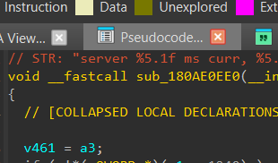

Function String Associate for IDA 9.X
---

<p align="center">
  
</p>

This plugin lets you auto-generate function comments using the string literals used inside of that function. Example:

```c
// STR: "Unable to load DLL: "%wZ", Parent Module: "%wZ", Status: 0x%x", "LdrpProcessWork", "minkernel\ntdll\ldrmap.c"
__int64 __fastcall LdrpProcessWork(__int64 a1, char a2)
{
  // [COLLAPSED LOCAL DECLARATIONS. PRESS NUMPAD "+" TO EXPAND]

  // ...
  v5 = result;
  if ( (int)result >= 0 || (_DWORD)result == -1073741267 )
    goto LABEL_16;
  result = LdrpLogInternal(
             (unsigned int)"minkernel\\ntdll\\ldrmap.c",
             2002,
             (unsigned int)"LdrpProcessWork",
             0,
             "Unable to load DLL: \"%wZ\", Parent Module: \"%wZ\", Status: 0x%x\n",
             a1,
             (*(_QWORD *)(a1 + 48) + 72LL) & (unsigned __int64)((unsigned __int128)-(__int128)*(unsigned __int64 *)(a1 + 48) >> 64),
             result);
  // ...
}
```

## Qt5 vs PySide6 IDA 9.2 migration

> [!NOTE]
> For more information, see https://docs.hex-rays.com/user-guide/plugins/migrating-pyqt5-code-to-pyside6.

The plugin uses `PySide6` on IDA `>=9.2` and `PyQt5` on older versions, based on `idaapi.IDA_SDK_VERSION`.

# Thanks To

This plugin is just a python rewrite of the original C++ implementation from @nihilus here: https://github.com/nihilus/IDA_FunctionStringAssociate_PlugIn
